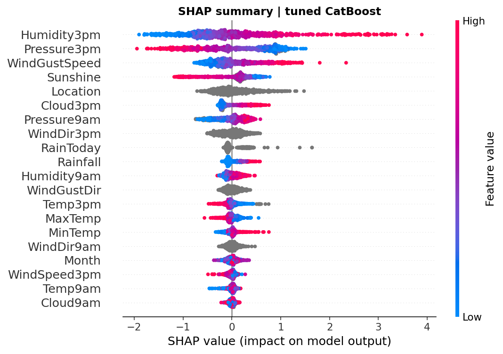

# 🌧️ Rain Tomorrow Prediction with CatBoost

An end-to-end machine learning project that predicts whether it will rain
tomorrow at Australian weather stations, using **CatBoost** gradient boosting
with **GridSearchCV** tuning, model benchmarking and **SHAP** explainability.
Built on ten years of real observations from the Australian Bureau of
Meteorology.


---

## Headline result

The tuned CatBoost model predicts next-day rain with **86.6% accuracy** and
**0.90 ROC-AUC**, well above a 77.6% majority-class baseline and a 85.0%
Logistic Regression. SHAP shows afternoon humidity, atmospheric pressure and
wind gust speed are the dominant drivers.

| Model | Accuracy | ROC-AUC | PR-AUC | F1 (rain) |
|-------|---------:|--------:|-------:|----------:|
| Majority baseline    | 0.776 | 0.500 | 0.224 | 0.000 |
| Logistic Regression  | 0.850 | 0.875 | 0.711 | 0.608 |
| CatBoost (default)   | 0.863 | 0.902 | 0.768 | 0.652 |
| **CatBoost (tuned)** | **0.866** | **0.904** | **0.772** | **0.659** |

---

## Dataset

"Rain in Australia": about ten years of daily weather observations from 49
stations, published by the Australian Bureau of Meteorology and distributed on
Kaggle. After dropping rows with a missing target, the working set has
**142,193 records and 22 features**. The positive class (rain tomorrow) is the
minority at about **22%**, so the problem is imbalanced.

Features include minimum and maximum temperature, rainfall, evaporation,
sunshine hours, wind gust speed and direction, humidity, pressure and cloud
cover at 9am and 3pm, plus the station Location and whether it rained today.

> Source: Australian Bureau of Meteorology, Daily Weather Observations.
> Kaggle dataset "weather-dataset-rattle-package".

---

## Why CatBoost

The data mixes numeric measurements with several categorical columns (49
weather-station locations, three 16-level wind-direction fields, a rain-today
flag) and has substantial missing values in some columns. CatBoost handles
categorical features and missing numeric values natively, so the pipeline needs
no one-hot encoding and no manual imputation for the gradient-boosting models.

---

## Pipeline

1. **Cleaning:** drop rows with a missing target, engineer a `Month` feature
   from the date, treat Location, wind directions and rain-today as native
   categoricals.
2. **Benchmarking:** majority-class baseline, Logistic Regression (with
   imputation, scaling and one-hot encoding) and CatBoost.
3. **Tuning:** `GridSearchCV` over `depth` and `learning_rate`, run on a
   stratified subsample for speed and then refit on the full training set.
4. **Evaluation:** accuracy, ROC-AUC, PR-AUC, precision, recall and F1, because
   accuracy alone is misleading on an imbalanced target.
5. **Explainability:** SHAP values for global feature attribution.

A stratified 80/20 train/test split with a fixed seed (42) keeps results
reproducible.

---

## Model comparison


Every model beats the naive majority baseline, and gradient boosting clearly
outperforms the linear model. GridSearchCV then adds a final increment on top of
the already strong CatBoost defaults. Best parameters: `depth=8,
learning_rate=0.1, iterations=400`.

---

## Tuned model performance


The ROC-AUC of 0.90 shows strong separation between rainy and dry days. The
precision-recall view is the more honest one for this imbalanced task: average
precision is 0.77, far above the 0.22 base rate.

---

## Explainability (SHAP)



High afternoon humidity (`Humidity3pm`) is the single strongest signal for rain,
while high afternoon pressure (`Pressure3pm`) pushes predictions toward a dry
day. Wind gust speed, sunshine hours and cloud cover follow. These are
physically sensible relationships, which is a good sign the model is learning
real weather patterns rather than artefacts.


---

## How to run

```bash
pip install -r requirements.txt
python src/train.py
```

Figures and `results.json` are written to `outputs/`.

> Note: the script trains on the full 142k-row dataset and tunes with
> GridSearchCV, so it benefits from a multi-core machine. On a single core the
> run takes several minutes.

---

## Project structure

```
weather-prediction/
├── data/
│   └── weatherAUS.csv
├── src/
│   └── train.py
├── outputs/
│   ├── model_comparison.png
│   ├── roc_pr_curves.png
│   ├── confusion_matrix.png
│   ├── feature_importance.png
│   ├── shap_summary.png
│   └── results.json
├── requirements.txt
└── README.md
```
